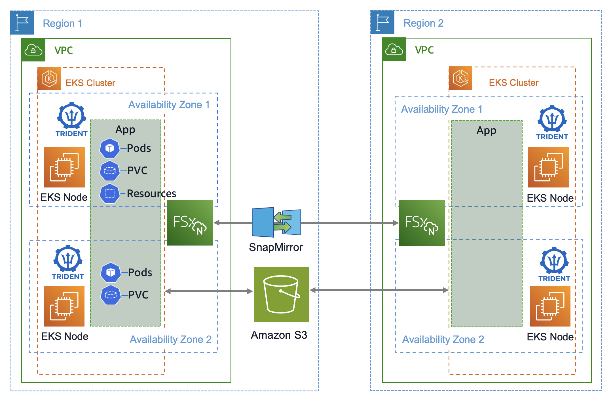
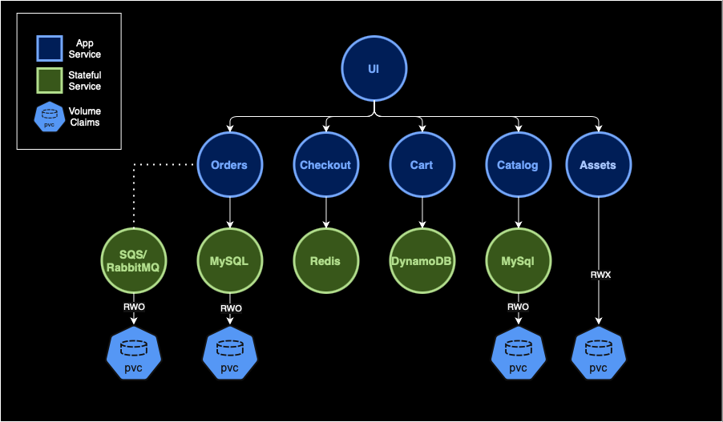
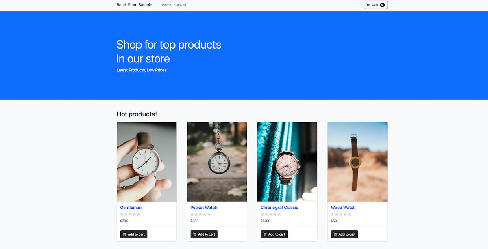

# Backup and Disaster Recovery for Amazon EKS resources using NetApp Trident Protect

For customers running applications and workloads on Kubernetes, protecting resources and data from accidental deletion or hardware failures is crucial for maintaining business continuity and meeting compliance requirements. While Kubernetes provides high availability through its control plane and worker node redundancy, it does not inherently protect against human errors, such as accidental deletion of namespaces, deployments, or persistent volumes, nor does it safeguard against regional failures or data corruption. 

The complexity of modern microservices architectures and the increasing scale of Kubernetes deployments make it even more critical to maintain regular, tested backups that can be restored consistently across different environments and regions. This includes backing up essential components such as entire namespaces, persistent volumes containing application data, custom resources, and configuration objects. Without proper backup mechanisms, organizations risk extended outages, data loss, and potential breach of service level agreements (SLAs), which can result in significant financial impact and damage to customer trust. This blog post will introduce a new data protection tool and provide a step-by-step guide to implementing a proof-of-concept within a Kubernetes environment.

### Trident Protect
[NetApp Trident Protect](https://docs.netapp.com/us-en/trident/trident-protect/learn-about-trident-protect.html) is a new, free-to-use tool from NetApp that provides Kubernetes cluster data protection, data migration, disaster recovery, and movement of containerized workloads across public clouds (such as AWS) and on-premises environments. It enables on-demand or on-schedule data protection tasks for Kubernetes cluster resources and persistent volumes to externally supported storage backends like Amazon S3. It offers automation capabilities through its Kubernetes-native API and powerful `tridentctl-protect` CLI, enabling programmatic access for seamless integration with existing workflows. AWS users can leverage Trident Protect to handle operations like cross-cluster disaster recovery (between regions or within a region), migration of stateful services between storage services, or moving resources running on a self-managed Kubernetes cluster into [Amazon Elastic Kubernetes Service (Amazon EKS)](https://aws.amazon.com/pm/eks/). 



In this blog post, we will focus on using Trident Protect with our AWS retail sample store application to handle data protection and migration tasks running on an Amazon EKS cluster. We'll also dive deep into some backup, recovery, and storage migration options that will help you decide what is best to implement in your organization's environment.  

The architecture below creates backups in our local region, which can be used to restore other namespaces within the same cluster and migrate from different AWS storage services. 

### Software Architecture
The AWS [retail store sample application](https://github.com/aws-containers/retail-store-sample-app) is built from microservices and backed by several stateful services. In total they consume 4 [Persistent Volume Claims](https://kubernetes.io/docs/concepts/storage/persistent-volumes/) (PVC) for each stack:
- Assets: Serves static assets like images related to the product catalog - Requires RWX volume like NFS
- Orders: Receive and process customer orders backed by MySQL DB and RabbitMQ - Requires 2 RWO block storage volumes
- Catalog: Product listings and details backed by MySQL DB - Requires RWO block storage volume



## Prerequisites 
To manually provision the resources used in this walkthrough, the list below provides the components and versions used. Alternatively, use the provided terraform resources to automate the entire deployment as shown in step 1 of the walkthrough.
- Amazon EKS cluster deployed version 1.32
    - [Pod Identity](https://docs.aws.amazon.com/eks/latest/userguide/pod-id-agent-setup.html) (eks-pod-identity-agent) add-on version v1.3.4
    - [NetApp Trident CSI add-on](https://docs.netapp.com/us-en/trident/trident-use/trident-aws-addon.html) version 25.02
    - [Amazon Elastic Block Store (EBS) CSI add-on](https://docs.aws.amazon.com/eks/latest/userguide/workloads-add-ons-available-eks.html#add-ons-aws-ebs-csi-driver) version v1.40.0-eksbuild.1
    - [Snapshot controller (snapshot-controller) add-on](https://docs.aws.amazon.com/eks/latest/userguide/csi-snapshot-controller.html) version v8.0.0
        - Create `VolumeSnapshotClass` for EBS and FSx for ONTAP (sample manifests are provisioned as part of the terraform: [EBS](./manifests/ebs-volume-snapshot-class) and [FSx for ONTAP](./manifests/fsxn-volume-snapshot-class)) 
    - [Load balancer controller (aws-load-balancer-controller)](https://docs.aws.amazon.com/eks/latest/userguide/aws-load-balancer-controller.html) version 2.11.0
- Deployed [Amazon FSx for NetApp ONTAP file system](https://docs.aws.amazon.com/fsx/latest/ONTAPGuide/getting-started.html) 

## Setup walkthrough
### 1. Create required infrastructure with terraform
Clone the sample repository from GitHub and create all relevant resources using the Terraform code in the repository:
```bash
$ git clone https://github.com/aws-samples/sample-eks-backup-with-trident-protect.git
$ cd sample-eks-backup-with-trident-protect/terraform
$ terraform init
$ terraform apply -auto-approve
```
> [!NOTE]
> The terraform script will prompt you to input a public IP address. This is the host's address that will access the UI of the sample application. 
>```shell
>var.ui_service_public_ip
>  The public IP addess of the host that will access the sample application >UI from the web browser
>
>  Enter a value: A.B.C.D/32      
>```

This deployment can take 20-25 minutes to complete. When finished, the output of the command should look like this:

```shell
fsx-management-ip = toset([
  "10.0.1.13",
])
fsx-ontap-id = "fs-a1b2c3d4e5f6g7h8i"
fsx-svm-name = "ekssvm"
region = "us-east-1"
secret_arn = "arn:aws:secretsmanager:us-east-1:0123456789ab:secret:fsxn-password-secret-8DKLpwTi-8DLlwE"
zz_update_kubeconfig_command = "aws eks update-kubeconfig --name eks-protect-8DKLpwTi --alias eks-primary --region us-east-1"
```

Next, copy and run the AWS CLI command from the `update_kubeconfig_command` output above and check we’re able to reach the cluster by running `kubectl get nodes`:
```shell
NAME                         STATUS   ROLES    AGE     VERSION
ip-10-0-1-120.ec2.internal   Ready    <none>   2m15s   v1.32.1-eks-5d632ec
ip-10-0-1-125.ec2.internal   Ready    <none>   95m     v1.32.1-eks-5d632ec
ip-10-0-2-42.ec2.internal    Ready    <none>   95m     v1.32.1-eks-5d632ec
ip-10-0-2-95.ec2.internal    Ready    <none>   2m9s    v1.32.1-eks-5d632ec
```
### 2. Deploy Trident Protect into Amazon EKS Cluster
Run the commands below to install the Trident Protect:
> [!IMPORTANT]
> Make sure you change clusterName to the EKS cluster name in your environment
```shell
helm repo add netapp-trident-protect https://netapp.github.io/trident-protect-helm-chart
helm install trident-protect-crds netapp-trident-protect/trident-protect-crds --namespace trident-protect --create-namespace
helm install trident-protect netapp-trident-protect/trident-protect --version 100.2502.0 --set clusterName=eks-protect-8DKLpwTi --namespace trident-protect
```
Expected output:
```shell
"netapp-trident-protect" has been added to your repositories
NAME: trident-protect-crds
LAST DEPLOYED: Tue Mar 11 15:57:42 2025
NAMESPACE: trident-protect
STATUS: deployed
REVISION: 1
TEST SUITE: None
NAME: trident-protect
LAST DEPLOYED: Tue Mar 11 16:01:09 2025
NAMESPACE: trident-protect
STATUS: deployed
REVISION: 1
TEST SUITE: None
```
### 3. Create Amazon S3 Bucket
If you have an existing S3 bucket, you can use it. If not, used the following steps to create a new S3 bucket. Replace `<bucket_name>` and `<aws_region>` with your values:
```shell
aws s3 mb s3://<bucket_name> --region <aws_region>
```

### 4. Create EKS Secret to store user credentials
Create a secret to store the trident protect user AWS accessKey and secretKey. You need to ensure that the user credentials you provide have the necessary permissions to access the bucket, see example [Amazon S3 policy statement](https://docs.netapp.com/us-en/trident/trident-protect/trident-protect-appvault-custom-resources.html#s3-compatible-storage-iam-permissions).

Use the following example to create the secret:
```shell
kubectl create secret generic <secret-name> \
--from-literal=accessKeyID=<accessKey> \
--from-literal=secretAccessKey=<seceretKey> \
-n trident-protect
```

### 5. Create Trident Protect AppVault
Next, we'll create the Trident Protect `AppVault`. The `AppVault` points to the S3 bucket where both snapshots and backup content, data and metadata is store. The `AppVault` will be created in the dedicated `trident-protect` backup namespace created in step 2 and can be secured with [role-based access control (RBAC)](https://docs.netapp.com/us-en/trident/trident-protect/manage-authorization-access-control.html) to restrict access to privileged objects to administrators. 
 
All remaining tasks will be created either in the original application namespace or the target one in case of the restore examples.
To create the `AppVault`, use the [protect-vault.yaml](./manifests/protect-vault.yaml) sample manifest. Update the following parameters:
- `providerConfig.s3.bucketName`: the S3 bucket name
- `providerConfig.s3.endpoint`: the S3 endpoint if the bucket is not in the `us-east-1` region 
- `providerCredentials.accessKeyID.name`: the EKS secret name from the previous step
- `providerCredentials.secretAccessKey.name`: the EKS secret name from the previous step
```yaml
---
apiVersion: protect.trident.netapp.io/v1
kind: AppVault
metadata:
  name: amazon-s3-trident-protect-src-bucket
  namespace: trident-protect
spec:
  properties:
    dataMoverPasswordSecretRef: my-optional-data-mover-secret
  providerType: AWS
  providerConfig:
    s3:
      bucketName: trident-protect-src-bucket
      endpoint: s3.amazonaws.com
  providerCredentials:
    accessKeyID:
      valueFromSecret:
        key: accessKeyID
        name: s3-secret
    secretAccessKey:
      valueFromSecret:
        key: secretAccessKey
        name: s3-secret
```
Run the following command to create the `AppVault`:
```shell
kubectl create -f ../manifests/protect-vault.yaml
```
To check if the `AppVault` was created successfully run the following command:
```shell
kubectl get appvault -n trident-protect
```
Expected output:
```shell
NAME                STATE       ERROR   MESSAGE   AGE
eks-protect-vault   Available                     4s
```
### 6. Create Trident Protect Application
To perform data protection operations on your EKS applications, you need to create a Trident Protect `Application` resource. An application can be defined in the following ways: 
- As a namespace whereby everything that is part of the namespace must be protected 
- As a subset of a namespace based on labels if you only want to protect part of a namespace (ex: only the PVC)
- It can span across multiple namespaces
- An application can also take into account cluster wide resources

To define the namespaces in which the application resources exist in, use `spec.includedNamespaces` and specify namespace labels or a namespace name.
You can use this sample [trident-application.yaml](./manifests/trident-application.yaml) manifest to define an `Application` for our sample-app.
```yaml
apiVersion: protect.trident.netapp.io/v1
kind: Application
metadata:
  name: sample-app
  namespace: tenant0
spec:
  includedNamespaces:
    - namespace:  tenant0
```
Run the following to create the `Application`:
```shell
kubectl create -f ../manifests/trident-application.yaml
```
To check the `Application` was created successfully run the following command:
```shell
kubectl get application -n tenant0
```
Expected output:
```shell
NAME         PROTECTION STATE   AGE
sample-app   None               14s
```

## Backup, restore, and migration walkthrough
### 1. Create Application Backup
Trident Protect has several data protection options available:
1. [On-Demand Snapshot](https://docs.netapp.com/us-en/trident/trident-protect/trident-protect-protect-apps.html#create-an-on-demand-snapshot)
2. [On-Demand Backup](https://docs.netapp.com/us-en/trident/trident-protect/trident-protect-protect-apps.html#create-an-on-demand-backup)
3. [Data Protection Schedule](https://docs.netapp.com/us-en/trident/trident-protect/trident-protect-protect-apps.html#create-a-data-protection-schedule)
4. [Application replication](https://docs.netapp.com/us-en/trident/trident-protect/trident-protect-use-snapmirror-replication.html)
5. [Application migration](https://docs.netapp.com/us-en/trident/trident-protect/trident-protect-migrate-apps.html)

> [!NOTE] 
> In this blog, we will focus on On-Demand Backup and Application Migration, but you can read more about how to use the other data protection options in the link references above.

To create an on-demand backup for our sample application, we will create a `Backup` resource for the `Application` we just create and point it to our S3 created `AppVault`. You can use the following [trident-backup.yaml](./manifests/trident-backup.yaml) sample manifest:
```yaml
apiVersion: protect.trident.netapp.io/v1
kind: Backup
metadata:
  namespace: tenant0
  name: sample-app-backup-1
spec:
  applicationRef: sample-app
  appVaultRef: eks-protect-vault
```
Run the following to create the `Backup`:
```shell
kubectl create -f ../manifests/trident-backup.yaml
```
To check if the `Backup` was created successfully run the following command:
```shell
kubectl get backup -n tenant0
```
Expected output:
```shell
NAME                  APP          RECLAIM POLICY   STATE       ERROR   AGE
sample-app-backup-1   sample-app   Retain           Completed           9m33s
``` 
> [!IMPORTANT]
> The state of the `Backup` can be `running` while the backup is in progress. Wait until the status gets to `Completed`. If the status is `Failed`, use `kubectl describe backup -n tenant0 sample-app-backup-1` to get more details on the failure. 

> [!TIP]
> If you check your `Application` Protection State, it is now set to `Partial` since you just have an on-demand backup set for your application, but no backup schedule. You can use `kubectl describe application -n tenant0` to check the status. 

### 2. Restore Application from a Backup
Trident Protect has several recovery options available:
1. Restore from backup
    - [Restore from a backup to a different namespace](https://docs.netapp.com/us-en/trident/trident-protect/trident-protect-restore-apps.html#restore-from-a-backup-to-a-different-namespace)
    - [Restore from a backup to the original namespace](https://docs.netapp.com/us-en/trident/trident-protect/trident-protect-restore-apps.html#restore-from-a-backup-to-the-original-namespace)
    - [Restore from a backup to a different cluster](https://docs.netapp.com/us-en/trident/trident-protect/trident-protect-restore-apps.html#restore-from-a-backup-to-a-different-cluster)
2. Restore from Snapshot
    - [Restore from a snapshot to a different namespace](https://docs.netapp.com/us-en/trident/trident-protect/trident-protect-restore-apps.html#restore-from-a-snapshot-to-a-different-namespace)
    - [Restore from a snapshot to the original namespace](https://docs.netapp.com/us-en/trident/trident-protect/trident-protect-restore-apps.html#restore-from-a-snapshot-to-the-original-namespace)

> [!NOTE] 
> In this blog, we will focus on restoring our sample-app backup to a different namespace on the same EKS cluster. You can read more about how to use the other recovery options on the link references above.

Let's review the `BackupRestore` resources spec:
- `spec.appArchivePath` - The path inside AppVault where the backup contents are stored
> [!TIP]
> You can retrieve the Archive Path by issuing the following command on your backup:
> ```shell
> kubectl get backup sample-app-backup-1 -n tenant0 -o jsonpath='{.status.appArchivePath}'
>```
- `spec.appVaultRef` - The name of the `AppVault` where the backup contents are stored
- `spec.namespaceMapping` -  mapping of the source namespace of the restore operation to the destination namespace

You can use the following [trident-protect-backup-restore.yaml](./manifests/trident-protect-backup-restore.yaml) sample manifest:
```yaml
---
apiVersion: protect.trident.netapp.io/v1
kind: BackupRestore
metadata:
  name: sample-app-restore-1
  namespace: tenant1
spec:
  appArchivePath: <APP ARCHIVE PATH>
  appVaultRef: eks-protect-vault
  namespaceMapping: 
    - source: tenant0
      destination: tenant1
  resourceFilter:
    resourceSelectionCriteria: "Exclude"
    resourceMatchers:
      - kind: TargetGroupBinding
```
If you need to select only specific resources within the application to restore, use the following filtering to include or exclude resources marked with particular labels. 
- `resourceFilter.resourceSelectionCriteria` - Use Include or Exclude to include or exclude a resource defined in `resourceMatchers`.
- `resourceFilter.resourceMatchers`:
    - `resourceMatchers[].group`: Group of the resource to be filtered
    - `resourceMatchers[].kind`: Kind of the resource to be filtered 
    - `resourceMatchers[].version`: Version of the resource to be filtered
    - `resourceMatchers[].names`: Names in the Kubernetes metadata.name field of the resource to be filtered
    - `resourceMatchers[].namespaces`: Namespaces in the Kubernetes metadata.name field of the resource to be filtered
    - `resourceMatchers[].labelSelectors`: Label selector string in the Kubernetes metadata.name field of the resource

As an example, you could use this sample code to include resources in your `BackupRestore` manifest:  
```yaml
spec:
  resourceFilter:
    resourceSelectionCriteria: "Include"
    resourceMatchers:
      - group: my-resource-group-1
        kind: my-resource-kind-1
        version: my-resource-version-1
        names: ["my-resource-names"]
        namespaces: ["my-resource-namespaces"]
        labelSelectors: ["trident.netapp.io/os=linux"]
```
> [!NOTE]
> For our application recovery, since it's using a LoadBalancer Type service in EKS, we'll exclude the `TargetGroupBinding` resources so that the [AWS Load Balancer Controller](https://kubernetes-sigs.github.io/aws-load-balancer-controller/latest/) can create a new `TargetGroupBinding` for our new namespace that will not be in conflict with our existing application on the cluster. 

Run the following to create the `BackupRestore`:
```shell
kubectl create -f ../manifests/trident-protect-backup-restore.yaml
```
To check if the `BackupRestore` was created successfully run the following command:
```shell
kubectl get backuprestore -n tenant1
```
Expected output:
```shell
NAME                   STATE       ERROR   AGE
sample-app-restore-1   Completed           115s
```
> [!IMPORTANT]
> The state of the `BackupRestore` can be `running` while the restore is in progress. Wait until the status gets to `Completed`. If the status is `Failed`, use `kubectl describe backuprestore -n tenant1 sample-app-restore-1` to get more details on the failure. 

After the restore process is finished, you can verify that your recovered application is up and running by accessing the UI service endpoint in your browser. 

> [!NOTE]
> You can get the UI service endpoint by issuing the following command:
> ```shell
> kubectl get svc ui -n tenant1 --output jsonpath='{.status.loadBalancer.ingress[0].hostname}'
> ```
If everything was successful, you should get the UI that looks like this:


### 3. Migrate between storage services
On this step, we'll migrate parts of our sample application stateful services from one storage service to another. We'll do that using the `storageClassMapping` feature of the Trident Protect `BackupRestore`. 

We'll migrate the catalog service MySQL database from an EBS volume to an FSx for ONTAP block volume. 

To do that, we'll execute two `BackupRestore` resources - one will recover all sample-application resources and data except for the `catalog-mysql` statefulset, and the other will recover and migrate the `catalog-mysql` statefulset from EBS to FSx for ONTAP block storage. 
Review the [trident-protect-migrate.yaml](./manifests/trident-protect-migrate.yaml). Notice we're using `resourceFilter` to exclude and include resources from the recovery process and `storageClassMapping` to migrate stateful resources to different storage backends. 

```yaml
  resourceFilter:
    resourceSelectionCriteria: "Exclude"
    resourceMatchers:
      - kind: StatefulSet
        names: ["catalog-mysql"]
      - kind: TargetGroupBinding
```
> [!IMPORTANT]
> Make sure you update `spec.appArchivePath` on both resources. You can retrieve the Archive Path by issuing the following command on your backup:
> ```shell
> kubectl get backup sample-app-backup-1 -n tenant0 -o jsonpath='{.status.appArchivePath}'
>```

You can check the source application and see that the original volume is using EBS by using the same command:
```shell
kubectl get pvc data-catalog-mysql-0 -n tenant0
```
Expected result:
```shell
NAME                   STATUS   VOLUME                                     CAPACITY   ACCESS MODES   STORAGECLASS   VOLUMEATTRIBUTESCLASS   AGE
data-catalog-mysql-0   Bound    pvc-0d795501-aca2-4e10-98b5-111ecc3aef2c   30Gi       RWO            ebs-csi        <unset>                 71m
```

Run the following to create the `BackupRestore` resources required for the migration:
```shell
kubectl create -f ../manifests/trident-protect-migrate.yaml
```
To check if the `BackupRestore` resources were created successfully run the following command:

```shell
kubectl get backuprestore -n tenant2
```
> [!IMPORTANT]
> The state of the `BackupRestore` can be `running` while the restore is in progress. Wait until the status gets to `Completed`. If the status is `Failed`, use `kubectl describe backuprestore -n tenant2 sample-app-migrate-#` to get more details on the failure. 

Expected result: 
```shell
NAME                   STATE       ERROR   AGE
sample-app-migrate-1   Completed           26m
sample-app-migrate-2   Completed           38s
```

We can now check that our catalog-mysql PVC was migrated from EBS to FSx for ONTAP by issuing the following command: 
```shell
kubectl get pvc data-catalog-mysql-0 -n tenant2
```
Expected result: 
```shell
NAME                   STATUS   VOLUME                                     CAPACITY   ACCESS MODES   STORAGECLASS      VOLUMEATTRIBUTESCLASS   AGE
data-catalog-mysql-0   Bound    pvc-8e45fa11-13ad-490d-b70c-d649b6fef4e9   30Gi       RWO            trident-csi-san   <unset>                 118s
```

After the migration process is finished, you can verify if your migrated application is up and running by accessing the UI service endpoint in your browser. 

> [!NOTE]
> You can get the UI service endpoint by issuing the following command:
> ```shell
> kubectl get svc ui -n tenant2 --output jsonpath='{.status.loadBalancer.ingress[0].hostname}'
> ```
If everything was successful you should get the UI that looks like this:


Congratulations! You've completed and mastered the basics of EKS backup, recovery, and migration using NetApp Trident Protect. This guide can be used as a best practice to implement protection, migration, and disaster recovery in your environment. 

### Clean-up 
To avoid unnecessary charges, make sure you delete all the resources created with terraform by running the following script from your terminal: 
```shell
sh ../scripts/cleanup.sh
```
If you created a new S3 bucket for this exercise, clean up by going to the AWS S3 console, [emptying](https://docs.aws.amazon.com/AmazonS3/latest/userguide/empty-bucket.html) the bucket, and [deleting](https://docs.aws.amazon.com/AmazonS3/latest/userguide/delete-bucket.html) it.

### Summary
In conclusion, NetApp Trident Protect provides a powerful solution for simplifying data protection of Kubernetes environments. This approach addresses the critical need for comprehensive backup strategies in cloud-native architectures. By leveraging Trident Protect, users can efficiently create and manage backups of entire namespaces, persistent volumes, and other essential Amazon EKS resources, ensuring business continuity and compliance with data protection requirements.

The step-by-step guide presented in this post demonstrates the ease of setting up and using Trident Protect with EKS, Amazon FSx for NetApp ONTAP, and EBS. Thank you for reading this post. Leave any comments or questions in the comments section.

## Security

See [CONTRIBUTING](CONTRIBUTING.md#security-issue-notifications) for more information.

## License

This library is licensed under the MIT-0 License. See the LICENSE file.


